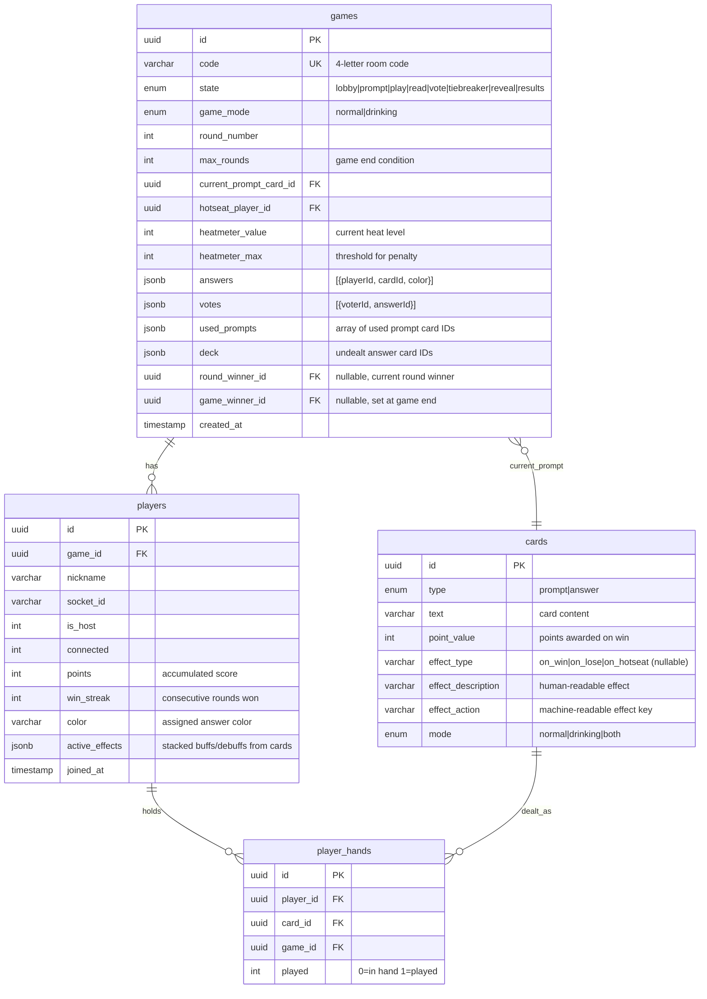

# Database Schema

## ER Diagram

## Design Decisions

### Single `games` table for room + game state

The room and the game are the same thing. A game in `lobby` state is just a room waiting for players. No need for a separate rooms table.

### Host is tracked on players, not games

The `is_host` flag lives on the `players` table. This avoids a circular foreign key (games → players → games) and simplifies inserts.

### States

- **lobby** — Players joining, host configuring game mode
- **prompt** — Prompt card revealed on host screen
- **play** — Players choosing answer cards from their hand
- **read** — AI reading answers aloud (color-coded)
- **vote** — Players (except hotseat) voting for best answer
- **tiebreaker** — Roulette wheel spinning to break a tied vote
- **reveal** — Winner announced, hotseat updated, effects applied
- **results** — Game over, final scoreboard shown. Host can start a new game.

### JSON columns for round-scoped data

`answers` and `votes` are JSONB columns because:

- They only matter for the current round
- They don't need relational queries
- They get reset each round
- Avoids creating/deleting rows every round

### Deck management

`deck` is a JSONB array of undealt answer card IDs. When a player needs new cards, you pop from the deck and create `player_hands` rows. When the deck runs out, you can reshuffle the discard pile (`player_hands` where `played = 1`).

`used_prompts` tracks prompt cards already shown so they don't repeat.

### `active_effects` on players

JSONB column for stacked buffs/debuffs from card effects. Structure defined in TypeScript, not enforced by the database. Can evolve freely without migrations.

### `player_hands` stays relational

Unlike answers/votes, hands persist across rounds and need proper foreign keys to track which cards belong to which player and whether they've been played. Also serves as the discard pile (cards where `played = 1`).

### Playing again

When the host starts a new game from `results`, create a fresh `games` row. The old one can be deleted or kept for history (stretch goal). Players get new `player_hands`, points/streaks/effects reset.

### No game history

This schema only tracks the current game. If we want history later (stretch goal), we can snapshot results at game end before cleanup.
